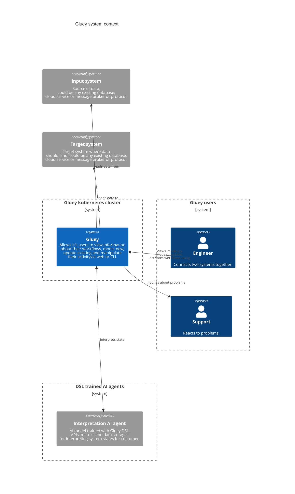
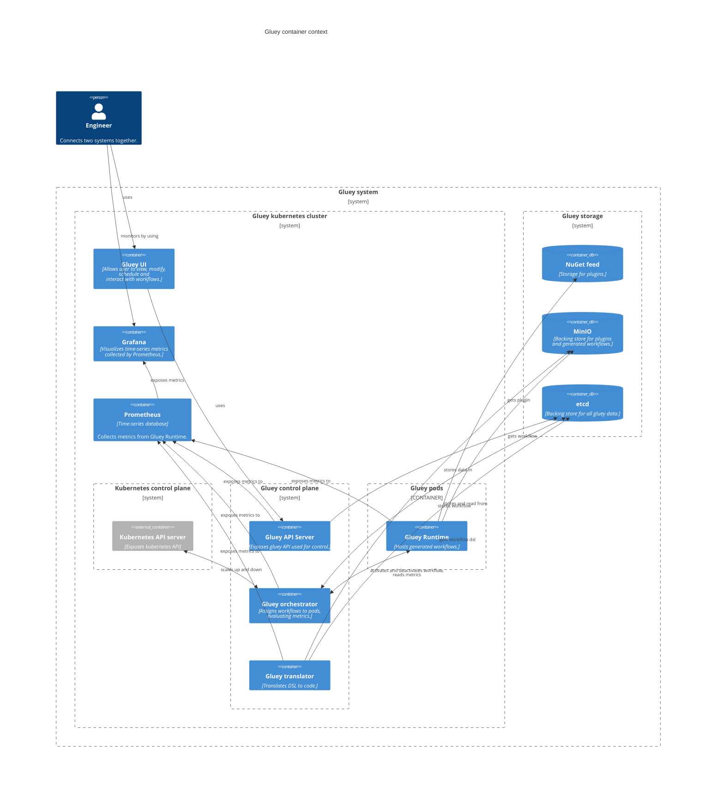
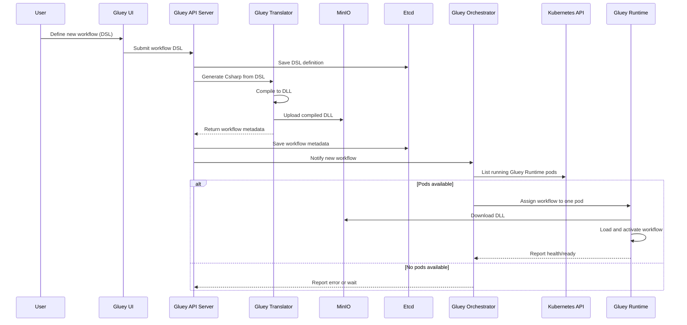
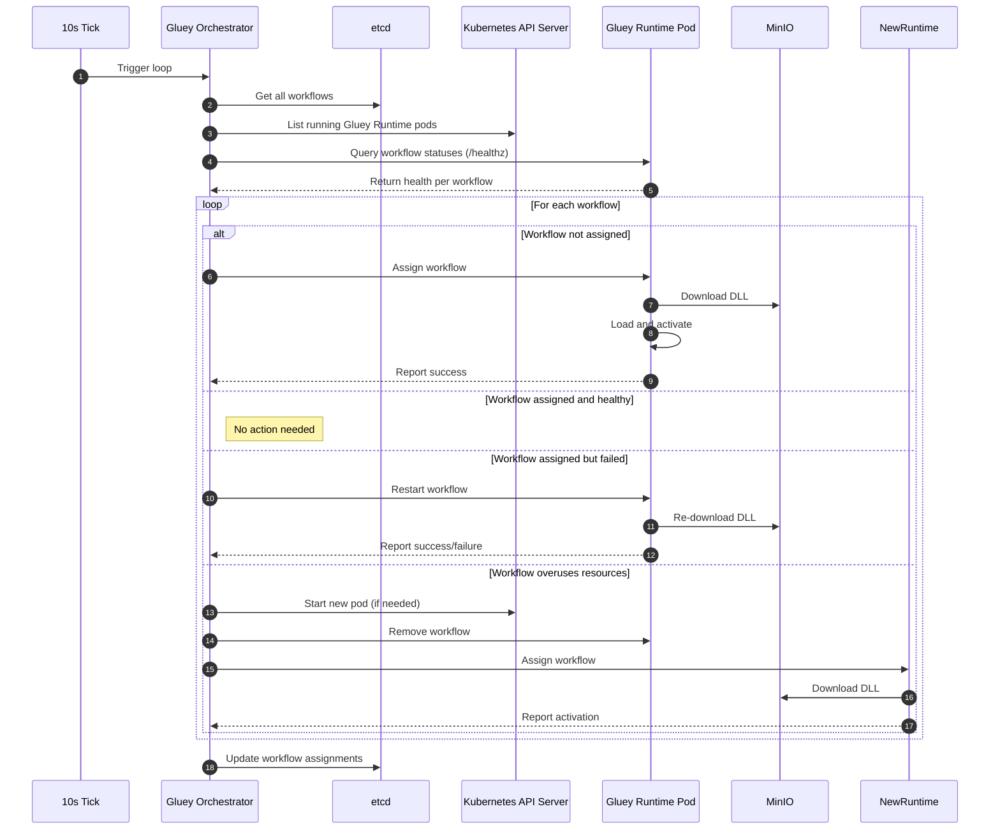

# Introduction
When integrating a device with the cloud, we often look for ways to optimize message size to reduce:
- connection costs
- message storage costs
- battery consumption
- risks of message non-delivery due to poor connection quality or protocol unreliability

However, this requires writing a dedicated parser on the cloud side to be able to use the data in further processing and interpretation. There are well-known and well-adopted formats such as protobuf, msgpack, json, xml, or avro, but each comes with its own overhead. One could argue that protobuf or msgpack trade size for portability and self-describing data, and that's true. Nevertheless, in some cases we fight for every byte, so the reality is that custom data formats still exist.

The situation is similar when building a new part of a cloud system onto an existing one, when connecting two independent systems, or when creating a system entirely from scratch. Moving data from place to place is the essence of business applications, whether through REST API, gRPC, MQTT, Modbus, or anything else.

Even when using standardized formats that simplify cloud processing, the data still needs to be translated and stored in a database. Every database has different storage methods, every project is different, so the state we store in the database or carry in a message is different.

To address this, we designed a tool that can read any data format from various sources, translate it into any other format, and pass it along. A tool designed with simultaneous modeling, documentation of flow behavior, and data version control in mind, maximizing readability and performance. It aims to facilitate management of the infrastructure needed for data transport, optimize costs of resources needed to deliver a message from one place to another, and simplify control while simultaneously documenting what the system does through visual data flow modeling.

The way the system holds information about messages and flow rules is described in a DSL (domain specific language) of our project, which is then translated by our system into a lower-level language, compiled, and executed. Because we have a unified way of describing messages and their flows, regardless of protocol, data source, and destination, an AI model trained by us can quickly detect problems in advance, react, diagnose where the problem might be, suggest how to improve the solution, and interpret data according to the owner's requirements. It's worth noting that the integrator modeling the data flow doesn't need to know this language, as the system comes with an interface that facilitates modeling through diagram visualization.

# Strategy
The tool primarily serves us, as we specialize in hardware design, automation, integrating devices to the cloud, and adapting data to the needs of the solution owner. In each of these areas, we need to transfer data from place to place, transform it, and store it. Instead of writing code over and over that glues two places together or copying communication standards between projects, we decided to create a system that will streamline and unify our work.

Our goal is to reconcile things that until now required a great deal of work and discipline to reconcile:
 - clear and understandable documentation of what's happening in the system
 - monitoring of processed messages
 - support for many data sources and destinations in an extensible and adaptable way
 - support for many message formats
 - tailor-made code written in the most optimal way possible
 - version control that is part of the system, not an additional process
 - flexible way of running locally, in the cloud, and on edge
 - resources that adapt to the solution's needs
 - early integration with AI for interpretation and support
 - portability, independence, freedom of choice - cloud agnostic
 - deployment speed
 - repeatability, uniformity, and ease of maintenance

However, we believe this is a widespread problem, which is why we decided to release this project as open source, of course with a plan to monetize through our own hosting and enterprise licensing.

Opening the code serves to build a community around our solution and verify whether people actually see value in our solution, as well as to support commercial projects and people with a unified way of connecting two systems together.

The name that represents our intention should be something that in the real world connects two things. Glue comes to mind, so the name is **Gluey**.

# Versioning
One of the problems that anyone who has maintained complex projects perfectly understands is how important versioning is. Most programming languages and frameworks enable versioning of their APIs, but this is a matter of discipline and process, not a built-in standard that helps and automatically versions every input and output. We address this by creating a system with the assumption that a single change in a message will be automatically escalated to the integrator with information about which workflow could potentially be affected. Not allowing the changed workflow to run without resolving the conflict.

This is done through semantic versioning, where:
 - removal or change of name, format, or schema of a message is a breaking change (major)
 - removal or change of name or type of one or more properties of our message is a breaking change (major)
 - adding a new message is backward compatible (minor)
 - adding a new property to a message is backward compatible (minor)
 - change in workflow logic, without changing any contracts, is a bugfix (patch)

 To achieve this, every message is versioned in terms of:
  - data format (binary, json, protobuf, msgpack, avro, and others)
  - message name (change is breaking)
  - description of what it does
  - its content, meaning every property used, whether primitive, scalar, or array — the above rules apply and escalate to the entire message.

 In the case where a user models a json message that has one property of type int32 named "a" and a second object that contains a string named "b", changing the name or type in the sub-object will cause the version of the entire message to be bumped, and consequently the entire workflow will require either a logic change or launching a second workflow with the new message schema.

# Performance
Although premature optimization is the root of all evil, we didn't want to skip it and reduce this system to dictionary-mapping json message contents, using jq as a transformation language, and forwarding. Because what happens when a binary message flows through our IoT system? You have to write code, and that takes time.

In one of the interviews with Uncle Bob, which I can't find now, when asked how he envisions the future of programming languages, he answered that they will tend toward ever-higher levels of abstraction. In my understanding, closer to human than to computer. What did he mean by that?

Well, first there were processor instructions, which were barely readable and understandable to humans, so language creators somewhat abstracted these repetitive elements into structures and expressions we know today, such as methods, loops, or conditions. These languages made writing and maintaining code easier in exchange for program size and a compilation process. However, they required manual memory management, so the next level of abstraction was managed languages that automatically handle memory at the cost of performance. That's where we are today. What would be the next level of abstraction?

In our opinion, an image, not a word. An image expresses more than a thousand words, and our mind is adapted to pattern recognition. Unfortunately, an image translates poorly into machine language that a computer understands. So we need an intermediate language. It's a language that models information, its data source, the logic of what happens to it, and destinations for sending. A language that architects and integrators understand because it can be presented as C4 diagrams, flowcharts, and BPMN. A language that serves as input for a translator that converts it into the preferred machine language.

This idea allows the translator to understand exactly the effect the integrator wants to achieve, resulting in a method that reads bytes from input, deserializes, maps to one or more messages, and forwards in the format the destination expects. This gives us the most efficient and lightweight code we can write. And translation can target many languages. Another advantage is that when new practices emerge in a given language, you only need to change the translator.

# Architecture
Many people define this word in a similar but different way. Closest to our heart is the definition that says architecture is the result of design decisions. The goal of the project is a system possessing the characteristics we wrote about in the strategy, so when making decisions, our aim was to fulfill as many of those assumptions as possible. Every decision we made was the best according to our state of knowledge at that time, which of course doesn't mean it actually was. As humans, we have limited cognitive capabilities and don't know everything. However, what we definitely know is that these decisions won't stay with us forever — the world changes, technology moves forward, and the solution should adapt. When designing this system, we had the assumption of creating an evolutionary architecture.

To present the result of our decisions, we chose to use the C4 model, which has several levels of abstraction (also called contexts):

 1. **System** - the highest level of abstraction, describing something that delivers value to its users, regardless of whether they are humans or not. At this level, we include both our system and others that our system depends on (or vice versa)
 1. **Container** - not to be confused with Docker. In the C4 model, a container represents an application or database. A container is a process that must run for the system as a whole to work as expected.
 1. **Component** - in the C4 model, this is a group of related functionalities, encapsulated behind a well-defined interface. It's a loose, informal collection of code.
 1. **Code** - finally, code, classes, interfaces, methods, functions, and objects.

## System Elements

To achieve cloud native and cloud agnostic status and be in the spirit of open source, we decided to use resources considered standard in this world. These are databases like etcd, postgres, mongodb, docker, and of course kubernetes. These are proven, mature solutions with very large communities, and every cloud enables hosting each of them, so they were a natural choice for us.

The language we used to write the backend is C#. This stems from the amount of experience I have in this language, which enables quickly expressing thoughts as code. It's also a language used by large enterprises, standardized, open source with a mass of libraries and a large community. Additionally, its author is a company that has its own cloud, so its future won't end anytime soon.

If in the future we determine that this language isn't enough — we'll certainly change it.

## System Context

Our goal is to streamline the integrator's work, i.e., reduce the amount of time needed to connect two separate systems or their parts with data. At this level, we consider the system to fulfill its role if it transfers data from source to destination without obstacles, and in case of problems, the support person receives a notification containing information about the problem, its cause, and recommendations with next steps.

Although the diagram presents the source and destination as external systems, this doesn't necessarily have to be true. The tool can be deployed as part of an existing system, where it serves as pipes for pushing data between databases.

It's worth mentioning that the people on the diagram represent roles. This means that physically one person can perform tasks assigned to each of them.




## Container Context - MVP

Integration, monitoring, versioning, diagnostics, audit, notifications, DSL, translation, user interface — this is a subset of functionality that is already too large to complete in finite time.

The set of processes presented at this level of the C4 diagram was assessed as the minimum that presents a working system. The systems we read from and write to are not on it because it's hard to visualize nicely (the diagram becomes overly complicated). That connection is from the gluey runtime.

It's worth noting that to increase diagram readability at this stage, certain things, for example those built into kubernetes, are not shown on this diagram.




### Container Context - System Elements
The diagram is very complex, there are many containers, relationships, and more than one database. Although at first glance it may be somewhat overwhelming, conceptually the principle of operation is very simple, and each element serves a function that completes the whole.

First, I'd like to discuss each system element individually. What it's responsible for and what characterizes it. Then, in the form of diagrams, I'll illustrate how system components communicate with each other in scenarios that are part of the MVP.

- **User Interface** - the main workplace of the engineer responsible for connecting two systems. It's a web application that through drag & drop operations enables modeling workflows, contracts, selecting source and destination for data, and configuring access to them. The engineer can stop a given workflow, install a plugin, and check a connection to validate the source and destination configuration for data.

- **Grafana** - an open source tool for configuring and visualizing telemetry data. In our case, it serves so that the engineer can see at a sufficient level of detail what the state of the kubernetes cluster, pods, workflows, and databases is.

- **Prometheus** - an open source tool for collecting metrics from our cluster and being their source for visualization tools. In our case, this is Grafana. It works by cyclically querying each system element.

- **NuGet feed** - source of input and output plugins for the runtime. Plugins are C# libraries written by us and by gluey maintainers, thanks to which it can handle many data sources (input) and destinations (output). In the MVP scope, we plan to have an MQTT input plugin and an EventHub output plugin. In the MVP scope, this is a simple nuget feed, since it's easy to write a plugin and push it somewhere for gluey to download. In the future, this will be a marketplace.

- **MinIO** - an open source, Amazon S3 compatible, kubernetes-native server for storing blob-type objects. In our case, we use it to store workflow DLLs. Widely adopted by the largest companies, it gives us cloud flexibility, allowing us to avoid vendor lock-in.

- **etcd** - an open source, cloud native, distributed, and reliable key-value store. The brain of kubernetes, but also used in situations requiring storage of critical and shared information for a running cluster of machines. It fits us, since Gluey is a distributed system where we need to track which workflow runs on which pod and what plugins should be installed. We need a database that is proven and reliable. Redis wasn't used for this because etcd guarantees greater data consistency in exchange for slower access.

- **Kubernetes API server** - an element of kubernetes architecture, being the main place where cluster interaction occurs. In our case, we use it in the gluey orchestrator to:
   - create, delete, check state and count of pods
   - modify existing deployments (e.g., number of replicas)
   - dynamically change configuration
   - retrieve logs from a pod

- **Gluey orchestrator** - the most important component of our system, responsible for managing the lifecycle of workflows in the Kubernetes cluster, including their scheduling, resource allocation, and supervision of their operation and scaling. It acts as a coordination layer between the metadata database, runtimes, and kubernetes infrastructure. It is responsible for:
  - assigning workflows to pods based on metrics
  - sending commands to gluey runtime to activate and deactivate workflows
  - retrieving metrics from gluey runtime (CPU, RAM, throughput)
  - requesting kubernetes api server for new pods or deletion
  - moving workflows between pods to reduce costs
  - reacting to workflow crashes, restarting elsewhere and notifying
  - considering workflow requirements and modes (at most once, exactly once, at least once)
  - receiving commands like "run this pod now", "pause now" from gluey API server

- **Gluey API server** - the main entry point to the Gluey system. It exposes an HTTP/REST interface, enabling users and external tools to manage workflows, plugins, configurations, and statuses. It serves as a domain controller over the Gluey model and delegates operations to other components (e.g., orchestrator, translator, storage)
  - creating, editing, deleting contracts and workflows
  - registering plugins to the nuget feed
  - forwarding workflow definitions to gluey translator
  - instructing the orchestrator to start or stop a given workflow
  - exposing API for retrieving state of workflows, pods, logs, metrics, etc.

- **Gluey translator** - the system component responsible for transforming a workflow definition (in DSL form) into ready, standalone C# code, and then compiling that code into a DLL that can be run by Gluey Runtime.
  - parses DSL and transforms to C# code
  - compiles C# to dll (Roslyn)
  - informs API server about required plugins
  - returns compilation errors and progress
  - publishes dll to minio and marks as ready in etcd

- **Gluey runtime** - a lightweight, scalable component running inside each pod in the Kubernetes cluster. Its main role is loading and executing workflows compiled to DLLs and maintaining active connections with inputs and outputs defined by each workflow.
  - on orchestrator's request, downloads and loads workflow from minio
  - has hardcoded (for MVP duration) plugins from which it reads and to which it writes
  - creates workflow instances and activates them
  - collects metrics
  - exposes health endpoints and workflow logs:
    - /healthz - runtime state
    - /healthz/workflowId - specific workflow state
    - /metrics - Prometheus-compatible metrics

### Container Context - Sequence Diagrams
To compensate for the poor readability of the C4 diagram, below we show sequence diagrams that illustrate how, for a given functionality, the various system components communicate with each other and what they do.

#### Adding a New Workflow


### Orchestrator Work Cycle



## MVP Scenario
Since we are a company specializing in creating devices, for the MVP we chose a typical example that we face when connecting devices to the cloud.

We receive a binary message on an MQTT broker, which we need to deserialize, split, and send to Event Hub. For simplicity, we assume that we need at least once delivery, and messages are considered delivered when Event Hub accepts them.

Demo steps:
1. Discussion of the device (dunamis)
1. Presentation of data on the MQTT broker
1. Connecting to event hubs to confirm there are no messages there
1. Opening Gluey UI and discussing capabilities
1. Selecting MQTT input and EventHub output from the list of installed plugins, dragging them onto the canvas
1. MQTT configuration
1. Event Hub configuration (connection string)
1. Dragging a previously prepared binary contract onto the canvas
1. Dragging a previously prepared json contract onto the canvas
1. Connecting properties that we map, showing conversion
1. Saving and running the workflow
1. Messages visible on Event Hub

## DSL
```
contract Binary version 0.0.1 {
    id: 'dunamis/battery/stateUpdate',
    name: 'stateUpdate'
    version: '0.0.1',
    displayName: {
        'en-US': 'Periodically sent message which carries information about battery state',
        'pl': 'Cyklicznie wysyłana wiadomość, która niesie informację o stanie baterii',
    },
    content:[
        {
            id: 'dunamis/battery/stateUpdate/recordedAgo'
            name: 'recordedAgo'
            version: '0.0.1',
            displayName: {

                'en-US': 'Value representing how many seconds ago data was recorded',
                'pl': 'Liczba całkowita reprezentująca ile sekund temu dane zostały przeczytane'
            },
            unit: 'second',
            schema: {
                kind: 'scalar',
                primitive: 'uint16'
            },
            offset: 0,
            length: 2
        }
        {
            id: 'dunamis/battery/stateUpdate/isCharging'
            name: 'isCharging'
            version: '0.0.1',
            displayName: {
                'en-US': 'Flag indicating whether or not battery is charging',
                'pl': 'Flaga wskazująca, czy bateria jest podpięta do ładowarki'
            },
            unit: 'flag'
            schema: {
                kind: 'scalar',
                primitive: 'boolean'
            },
            offset: 2,
            length: 1,
            bit: 0
        },
        {
            id: 'dunamis/battery/stateUpdate/level'
            name: 'level'
            version: '0.0.1',
            displayName: {
                'en-US': 'Integer value indicating percent of battery state',
                'pl': 'Liczba całkowita reprezentująca procent naładowania baterii',
            },
            unit: 'percent'
            schema: {
                kind: 'scalar',
                primitive: 'uint8'
            },
            offset: 3,
            length: 1,
            endianess: 'little'
        },
        {
            id: 'dunamis/battery/stateUpdate/operatorBadgeId'
            name: 'operatorBadgeId',
            version: '0.0.1',
            displayName: {
                'en-US': 'Unique identifier of forklift operator\'s badge',
                'pl': 'Identyfikator operatora, który jest najbliżej wózka widłowego',
            },
            unit: 'plain',
            schema: {
                kind: 'scalar',
                primitive: 'string',
                encoding: 'ASCII'
            },
            offset: 4,
            length: 6
        },
        {
            id: 'dunamis/battery/stateUpdate/lastThreeVoltages'
            name: 'lastThreeVoltages',
            version: '0.0.1',
            displayName: {
                'en-US': 'Last three voltage measurements',
                'pl': 'Ostatnie trzy pomiary napięcia',
            },
            unit: 'Volt',
            schema: {
                kind: 'array',
                schema: {
                    kind: 'scalar',
                    primitive: 'float32'
                },
            },
            offset: 6,
            elements: 3,
            padding: 0,
            endianess: little
        }
    ]
}
```
